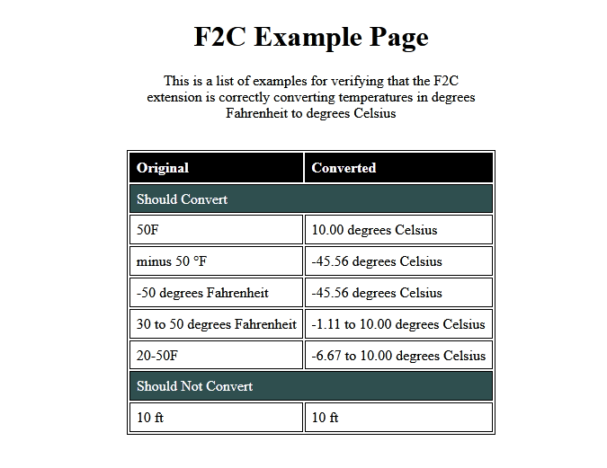

# f2c-extension

A browser extension for automatically converting degrees Fahrenheit to degrees Celsius in the page text.

Fig. 1. Example conversions.

Tested against Firefox 73 and Chrome 80.

The published extension is [available on addons.mozilla.org](https://addons.mozilla.org/en-US/firefox/addon/f2c/), visibility may be pending reviewer approval.

## To Build the Zipped Extension Package

* `git clone` the [source code](https://github.com/jimCresswell/f2c-extension) with remote [https://github.com/jimCresswell/f2c-extension.git](https://github.com/jimCresswell/f2c-extension.git).
* Install [Node](https://nodejs.org/en/) (tested on 10.x and 12.x) and [yarn](https://classic.yarnpkg.com/en/docs/install) (currently using 1.x).
* `yarn` then `yarn build` to download the dependencies and build the extension in the `./dist` directory.
* Zip the contents of the `./dist` directory.

## Scripts

Commands are given with `yarn`, `npm run` will also work.

| Command         | Description                                                                   |
| :---             | :---                                                                           |
| <code>yarn&nbsp;build</code>    | Builds the extension with Webpack in the `dist` directory.                    |
| <code>yarn&nbsp;dev</code>      | `web-ext` opens an instance of Firefox with the extension temporarily installed for testing. Note the existence of [test/test.html](./test/test.html) to help with manual testing. |
| <code>yarn&nbsp;lint:ext</code> | Lint the web extension config with `web-ext`.                                  |
| <code>yarn&nbsp;lint:code</code> | Runs Eslint against the code.                                                 |
| <code>yarn&nbsp;test:src</code>  | Runs the unit tests with Mocha. Test files live next to the module they test. |

## Notes

* Continuous integration is via GitHub actions, config is [here](./.github/workflows).
* Babel is used to transpile the test code, but not the application code (it doesn't need it yet). An alternative would be to remove Babel from the Mocha options and use [mocha-webpack](https://github.com/zinserjan/mocha-webpack) instead.

## Future Enhancements

* Wrap the modified content in a `span` and style to highlight changes.
* Allow extension to be turned off from the `browser action` popup.
* Count how many changes were made and display in the popup.
* Process numbers written as words.
* Handle temperatures ranges and single temperatures in the same text node.
